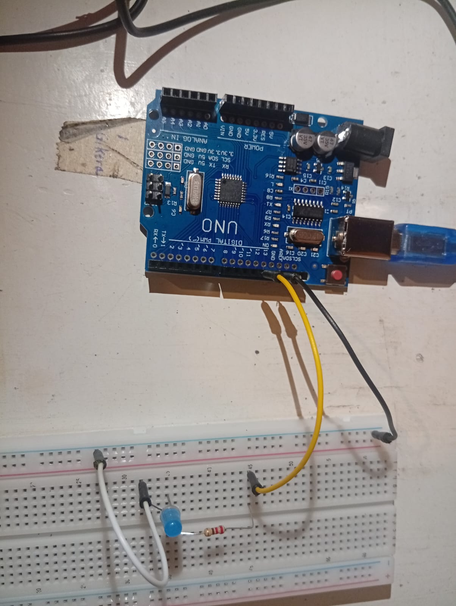
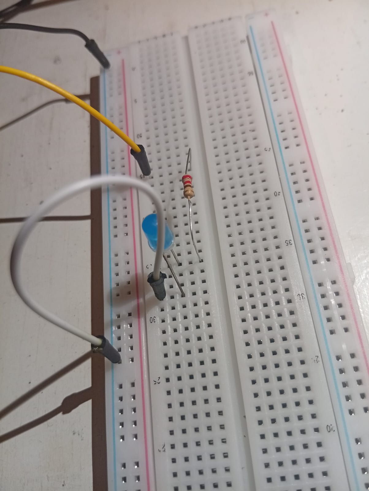

                ======================    
                    BLINKING ONE LED
                ======================
this is to blink one LED

# REQUIREMENTS
- arduino ide
- arduino uno or something similar
- usb cable connecting arduino and laptop
- 3 jumper wires
- breadboard
- LED light
- 220 ohm resistor

# CONNECTION FLOW
digital pin 13 -> yellow wire -> resistor -> LED -> white wire ->  negative rail -> black wire -> GND pin

## NOTE
resistor is connected to long leg of LED

    
    

