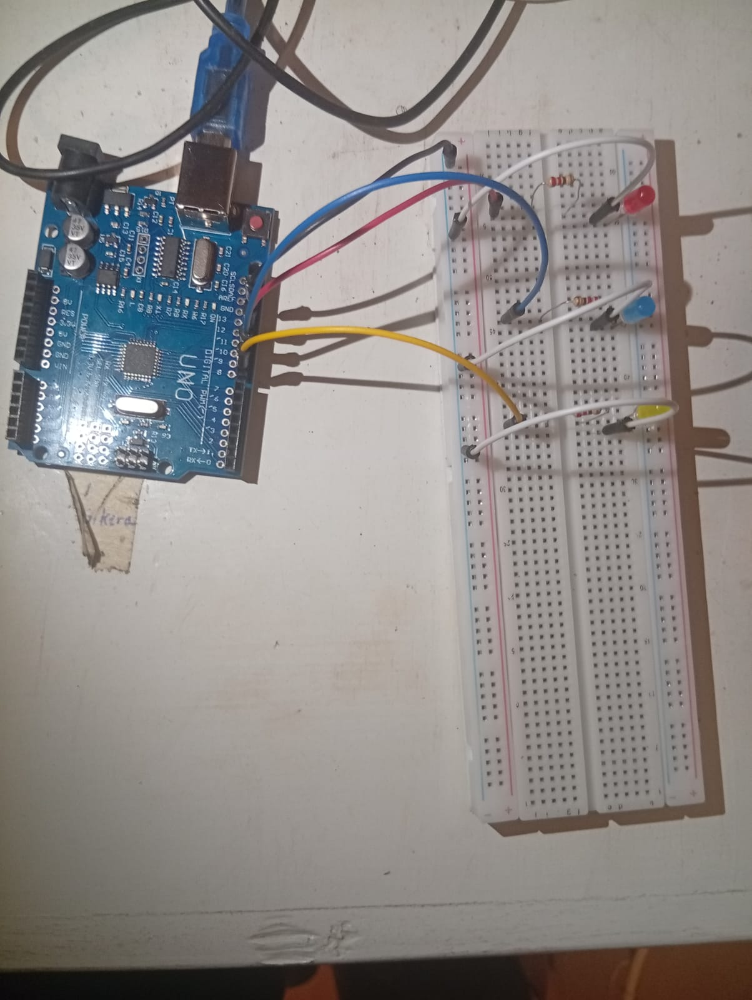
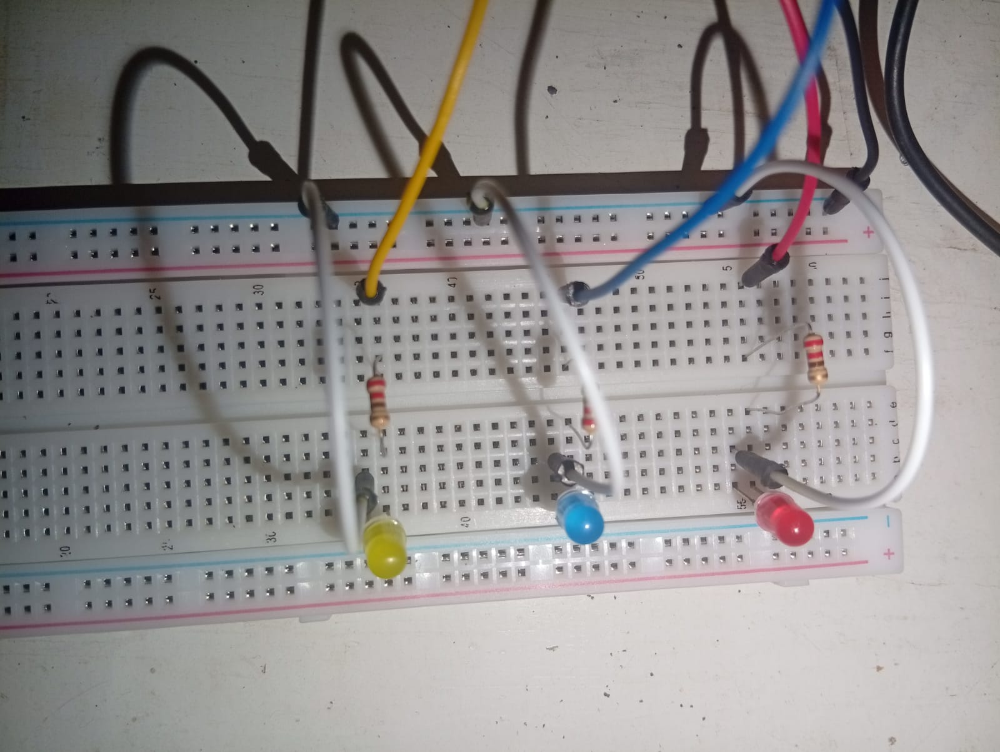

                ======================    
                    BLINKING THREE LEDS
                ======================
this is to blink THREE LED in sequence

# REQUIREMENTS
- arduino ide
- arduino uno or something similar
- usb cable connecting arduino and laptop
- jumper wires
- breadboard
- 3LED light
- 3 220-ohm resistors

# CONNECTION FLOW
### red 
digital pin 12 -> red wire -> resistor -> LED -> white wire ->  negative rail 
### red 
digital pin 10 -> blue wire -> resistor -> LED -> white wire ->  negative rail 
### red 
digital pin 8 -> yellow wire -> resistor -> LED -> white wire ->  negative rail pin

## NOTE
resistor is connected to long leg of LED
negative rail is connected to GND pin by the black wire

    
    

