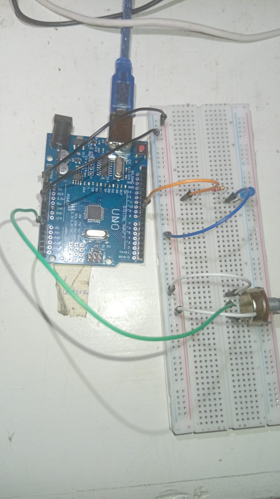
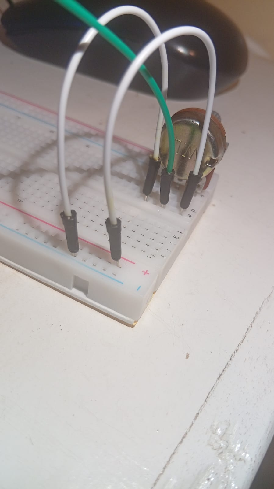
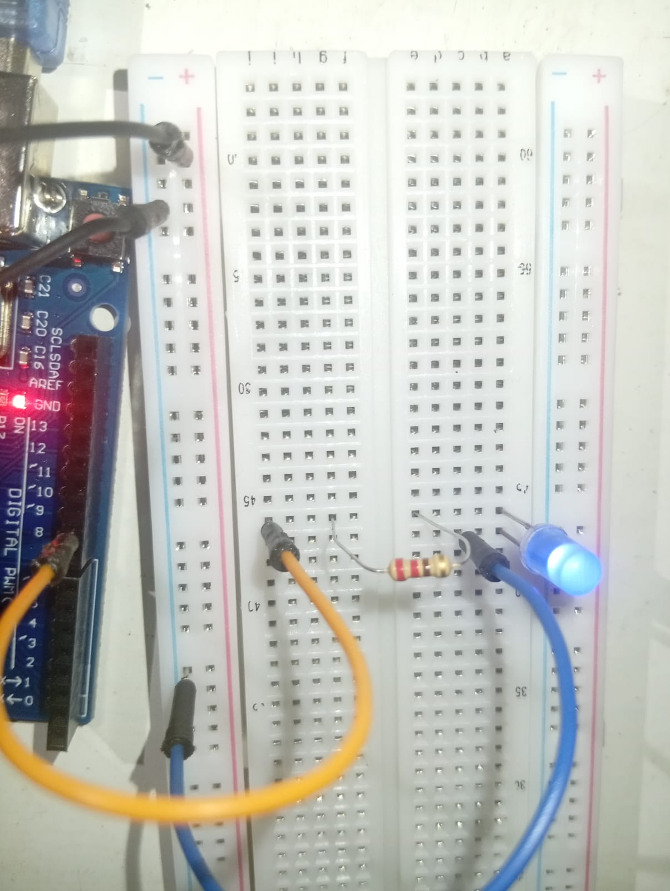
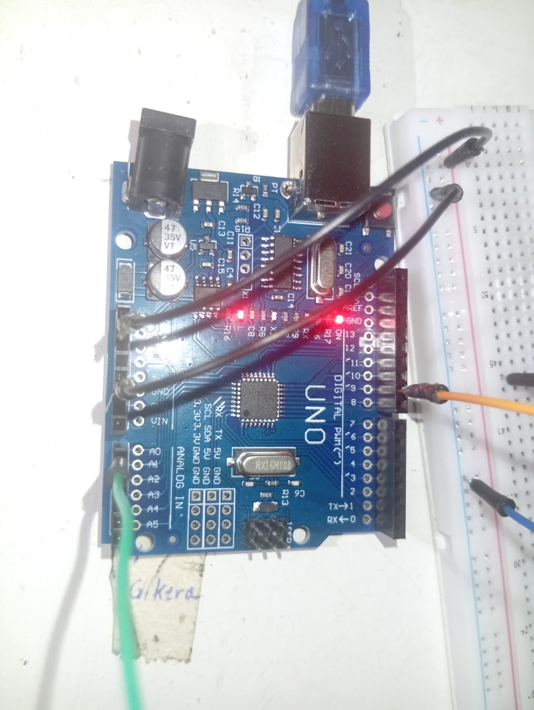

               ======================    
                    ADJUSTABLE LED
                ======================
Adjusting brightness of an LED using potentiometer

# REQUIREMENTS
- arduino ide
- arduino uno or something similar
- usb cable connecting arduino and laptop
- jumper wires
- breadboard
- LED light
- an 220-ohm resistor
- potentiometer

# CONNECTION FLOW
- black wires provide 5V from the 5V pin while the other black wire connects negative rail to GND pin
- orange wire transmitt signal from digital pin 9 to the resistor, resistor to LED
- blue wire connects LED to negative Rail
- white wires connect and complete the circuit of the potentiometer
- green wire transmit signal to analog pin A0

## NOTE
resistor is connected to long leg of LED
check the terminals of your potentiometer and connect appropriately

    
    
    
    

