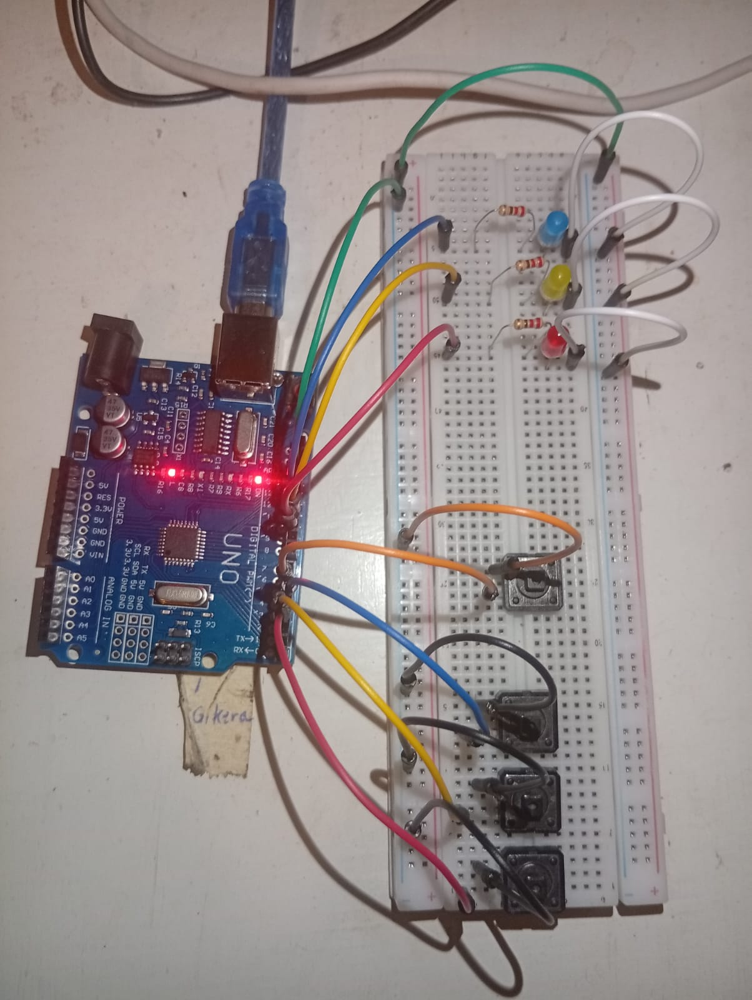
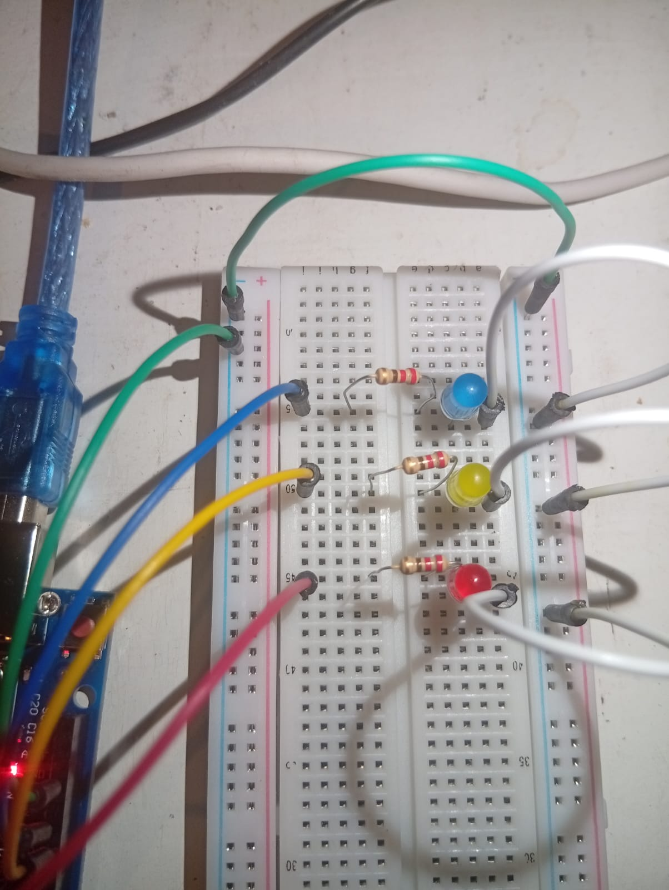
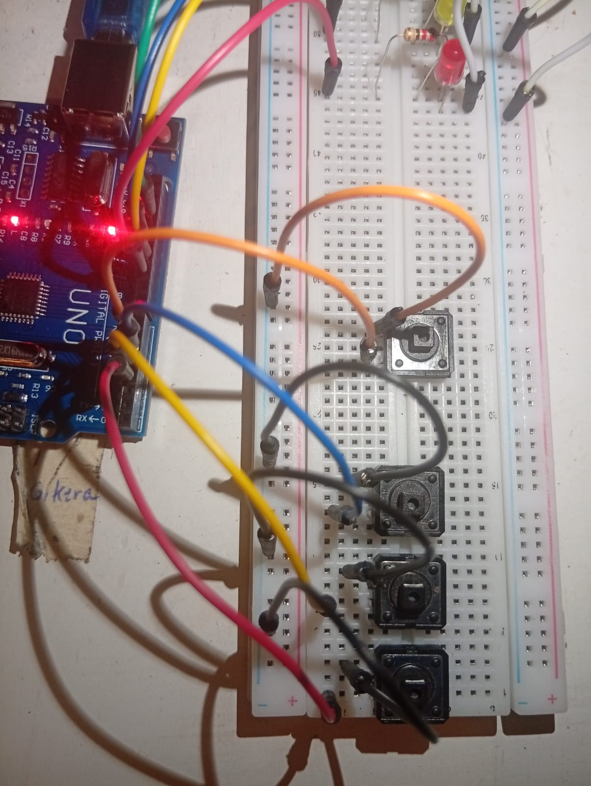
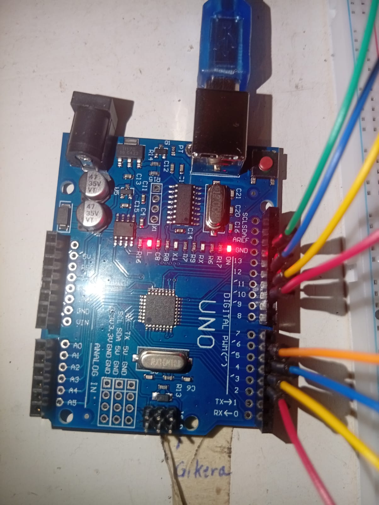

               ======================    
                    SWITCHES & LED
                ======================
Turning LEDs on and off using switches

# FEATURES
- first switch turns on all LEDs when pressed
- Second switch turns on all Blue LED when pressed
- Third switch turns on all Yellow LED when pressed
- Fourth switch turns on all Red LED when pressed 

# REQUIREMENTS
- arduino ide
- arduino uno or something similar
- usb cable connecting arduino and laptop
- jumper wires
- breadboard
- 3 LED lights
- 3 220-ohm resistors
- 4 switches

# CONNECTION FLOW
- black wires connect the last three switches to the negative rail, 
- orange wires connect the main switch 
- white wires coonect the LEDs to the negative rail
- first green wire connectS GND to negative rail while the other links the two negative rails
- the red blue and yellow pairs of wires are pairs. the first set of RYB wires connect to the pins 3, 4 , 5 which are connected to the switches ibdividually. the last pair connects to the three LEDs individually

## NOTE
resistor is connected to long leg of LED
check the terminals of your potentiometer and connect appropriately

    
    
    
    

