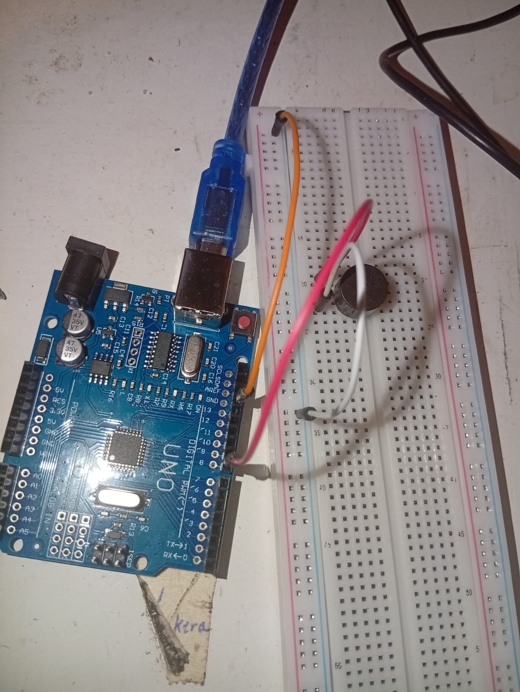

               ======================    
                    PIEZO BUZZER
                ======================
Playing Clocks by coldplay using piezo buzzers

# REQUIREMENTS
- arduino ide
- arduino uno or something similar
- usb cable connecting arduino and laptop
- jumper wires
- breadboard
- piezo buzzer

# CONNECTION FLOW
- data flows from pin 8 to positive of piezo buzzer
- negative terminal of piezo buzzer is connected to GND through terminal rail

## NOTE
ensure pin 8 is connected to positive of piezo buzzer

    
 

