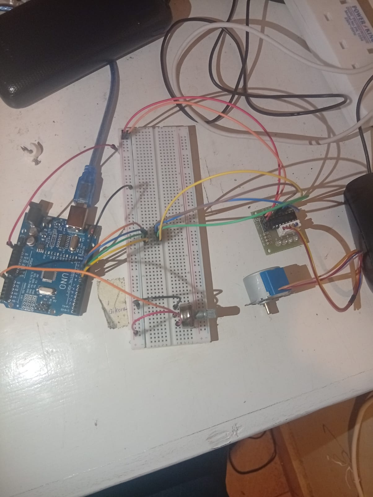
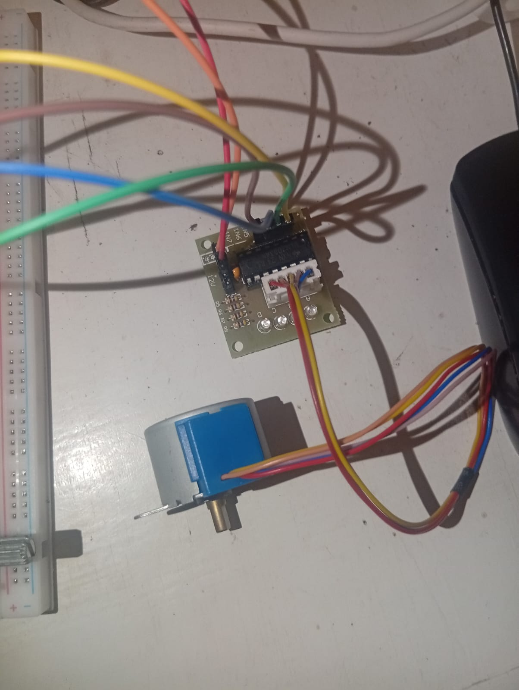
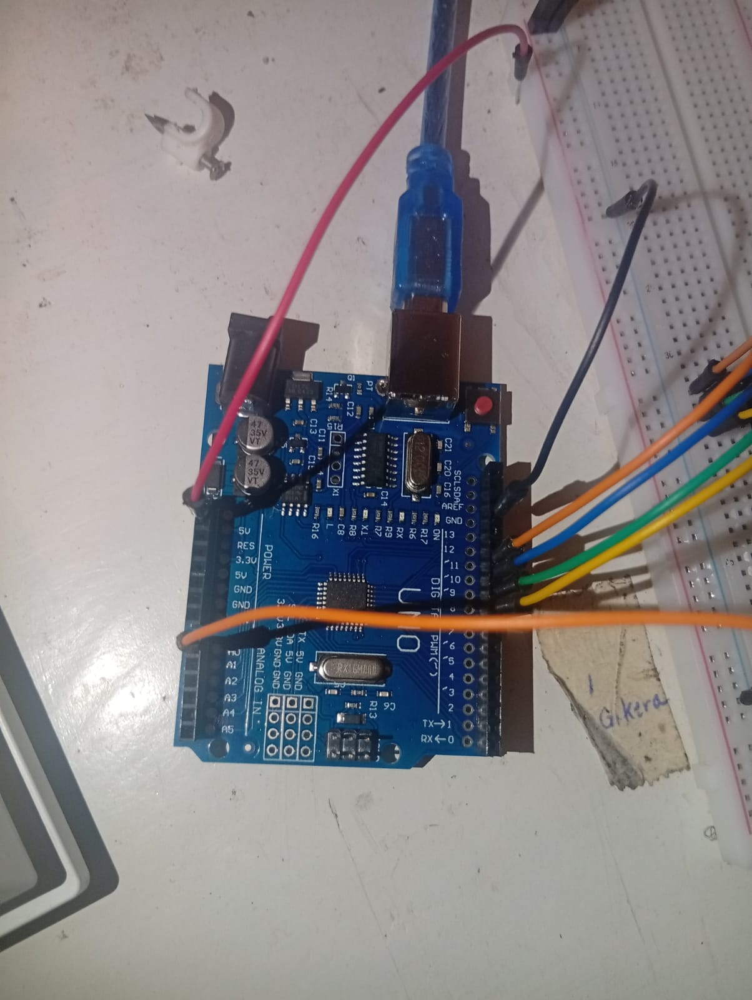
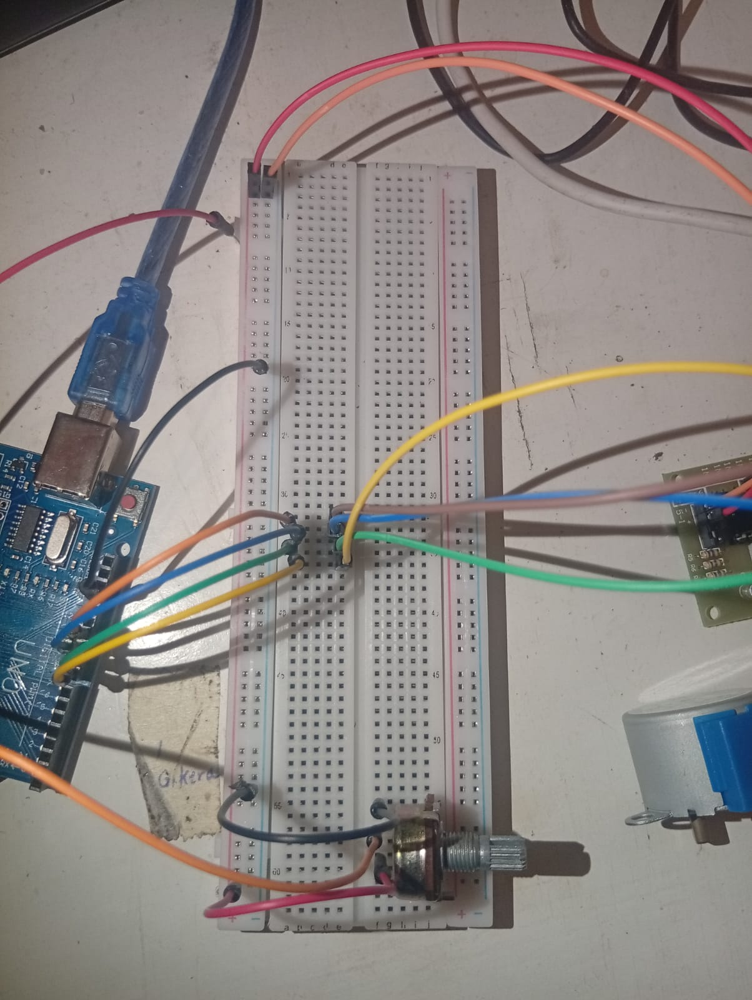

                ==================================    
                STEP MOTOR & POTENTIOMETER
                =================================
Turning a step motor using a potentiometer

# REQUIREMENTS
- arduino ide
- arduino uno or something similar
- usb cable connecting arduino and laptop
- jumper wires
- breadboard
- step motor (28BYJ-48)
- driver board (ULN2003)
- potentiometer

# CONNECTION FLOW
- black wires are all negative
- red wires are 5V positive
- the orange and red wire power the motor and driver each being negative and positive(5V) respectively
# DATA FLOW
- data flows from potentiometer to pin A0 through orange
- data the flows from pins 8, 9, 10, 11 to the driver board through the yellow, green, blue, orange/brown wires respectively.

    
    
    
    
 

